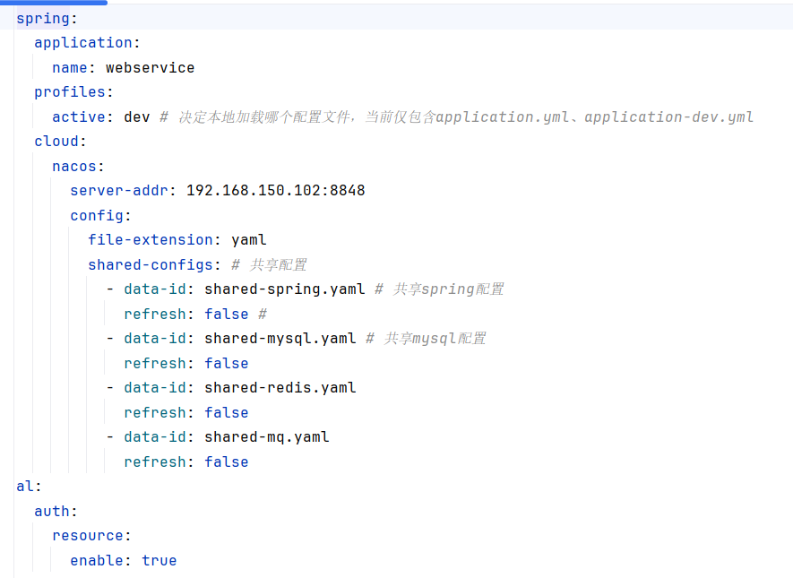

# 仿制B站-Java后端服务器-微服务版

# 部署项目

## 1 准备工作

### 1.1 环境

- 安装MySQL，推荐8.0版本
- 安装Redis，推荐6.x版本
- 安装RabbitMQ，推荐4.2.3（Erlang为27.3.4.7）
- 安装Minio，推荐RELEASE.2024-08-29T01-40-52Z

### 1.2 修改环境变量

本项目与MySQL、RabbitMQ、Redis相关的连接配置都写在Nacos的共享配置里，没有直接写在本地。你可以自己按照下图中的名字在Nacos中创建名字一样的共享配置文件，也可以直接修改本地配置。



配置文件写法示例：

```yaml
# shared-mysql.yaml
spring:
  datasource:
    username: root
    password: 123456
    driver-class-name: com.mysql.cj.jdbc.Driver
```

```yaml
# shared-redis.yaml
spring:
  data:
    redis:
      host: 192.168.150.102
      port: 6379
      password: 123456
      database: 5
```

```yaml
# shared-mq.yaml
spring:
  rabbitmq:
    host: 192.168.150.102
    port: 5672
    virtual-host: AniLink
    username: admin
    password: admin123
```


## 2 正式开始

本仓库提供Java后端工程源代码。推荐克隆main分支的源代码，其他分支为开发测试。

- 选取一个文件目录，打开命令行界面，输入：`git clone -b main https://github.com/All1217/AniLink-Java.git`
- 使用IDEA或其他方式打开
- 按需启动模块，推荐全部启动，并且推荐的启动顺序：AL-gateway---->AL-communication---->AL-remark---->AL-web