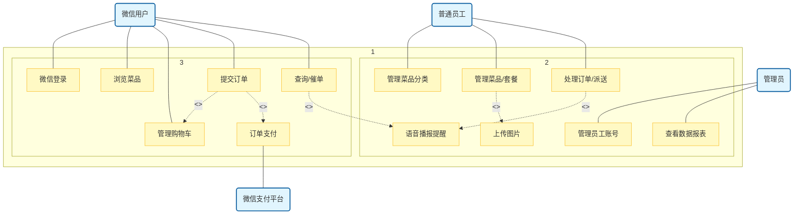
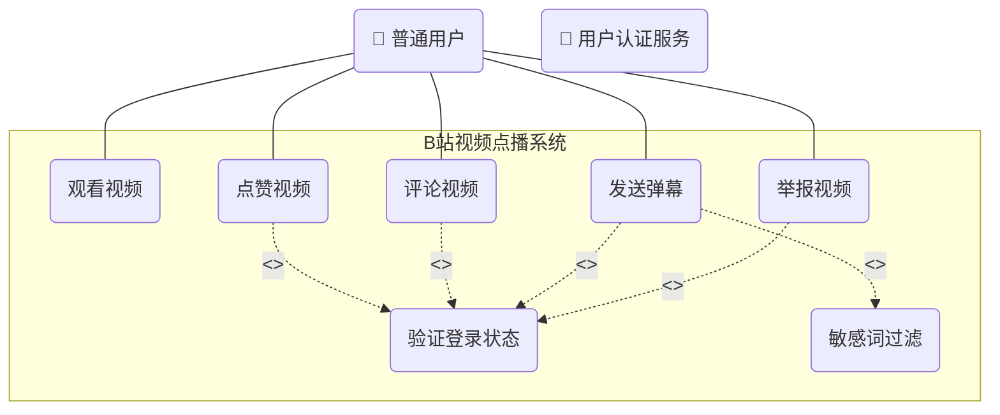
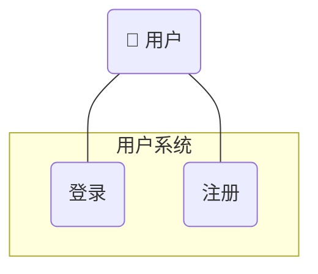
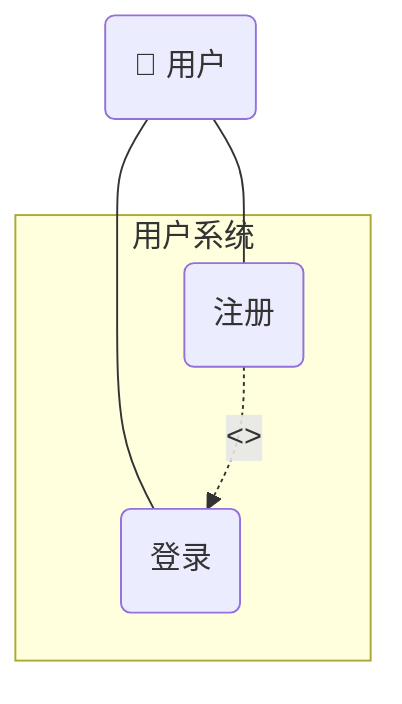
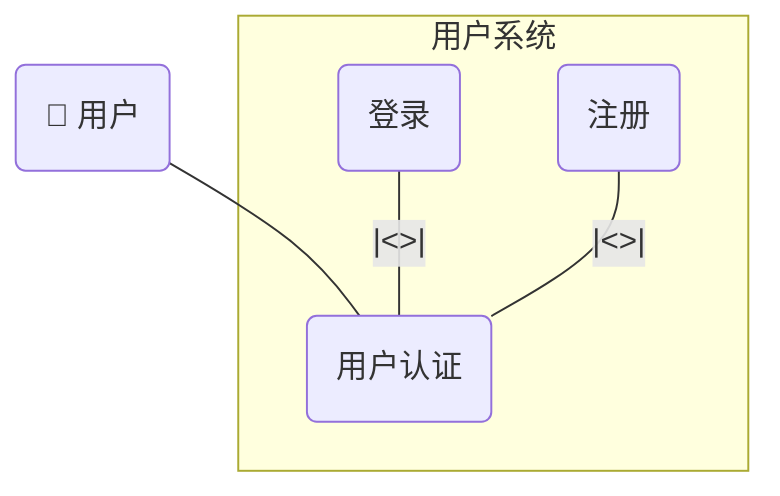
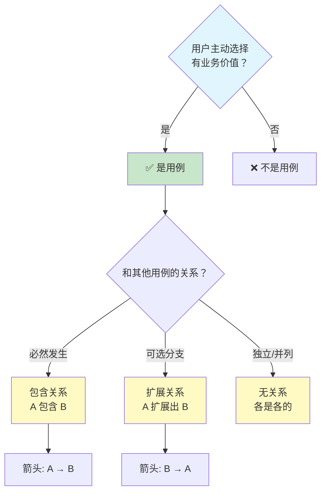

# 写在前面

背景：毕业设计论文涉及到系统需求分析，需要画UML用例图，并且尽量规范。

一些基础教程博客：

- [UML建模——用例图（Use Case Diagram） - lclc - 博客园](https://www.cnblogs.com/lcword/p/10472040.html)
- [(1 条消息) 软件设计之UML用例图大白话教程 - 知乎](https://zhuanlan.zhihu.com/p/628741228)

# Deepseek的意见

## 1 问题1

> 绘制规范的UML用例图有哪些要点？以知名公开课《苍穹外卖》（偏重Java后端）为例绘制简单的用例图

### 一、 绘制UML用例图的三大核心要点

#### 1. 明确参与者（Actor）
参与者是**在系统外部**、与系统进行交互的人或其他系统。关键是区分**业务执行者**和**系统执行者**。以苍穹外卖为例，用户端的小程序使用者是顾客，但直接与后端API交互的是微信小程序前端。

#### 2. 定义用例（Use Case）
用例必须是一个**完整的、有意义的业务场景**。比如“填写收货地址”只是操作步骤，不能作为用例，真正的用例是“提交订单”，因为用户的目标是完成下单。用例命名推荐采用**动宾结构**，如“新增菜品”、“查询订单”。

#### 3. 理清关系（Relationship）
用例图中有三种关键关系：
- **关联（Association）**：参与者与用例之间的连线，表示“能做什么”。
- **包含（Include）**：一个用例必然会用到另一个用例（箭头指向被包含者）。例如：提交订单 -> `<<include>>` -> 验证库存。
- **扩展（Extend）**：一个用例在某些条件下会触发额外功能（箭头指向基础用例）。例如：订单支付 -> `<<extend>>` -> 打印发票（仅在用户需要时触发）。

---

### 二、 《苍穹外卖》用例图实例解析

基于“苍穹外卖”的分体式架构（管理端 + 用户端），用例图通常分为两个视角绘制。

#### 1. 管理端（后台系统）
**系统边界**：管理后台系统
**核心参与者**：管理员、普通员工

- **管理员**：拥有最高权限，除了管理菜品，还需要管理**员工账号**。
- **普通员工**：负责日常的菜品维护和订单处理。

| 参与者          | 用例模块     | 具体用例                                 | 关键扩展/包含关系                              |
| :-------------- | :----------- | :--------------------------------------- | :--------------------------------------------- |
| **管理员**      | 权限管理     | 管理员工账号（增删改查）                 | （无特殊关系）                                 |
| **管理员/员工** | 基础数据维护 | 管理菜品分类、管理菜品/套餐（上架/下架） | `<<include>>` 上传图片（OSS）                  |
| **管理员/员工** | 订单处理     | 查看订单、**派送订单**                   | 来单提醒 -> `<<extend>>` 语音播报（WebSocket） |
| **管理员**      | 运营分析     | 查看数据报表（营业额、用户量）           | （依赖底层数据统计服务）                       |

#### 2. 用户端（小程序端）
**系统边界**：外卖服务系统
**核心参与者**：普通用户（注册用户/游客）、**微信支付平台**（外部系统）

- **微信支付**：这是一个特殊的**辅执行者**，由用户发起支付动作，系统回调微信平台完成扣款。

| 参与者            | 用例模块 | 具体用例                           | 关键扩展/包含关系                                            |
| :---------------- | :------- | :--------------------------------- | :----------------------------------------------------------- |
| **用户**          | 身份认证 | **微信授权登录**（获取OpenId）     | （无特殊关系）                                               |
| **用户**          | 点餐流程 | 浏览菜品、加入购物车、**提交订单** | 提交订单 -> `<<include>>` -> 确认收货地址；<br>提交订单 -> `<<include>>` -> 清空购物车 |
| **用户/支付平台** | 支付结算 | **订单支付**                       | 支付 -> `<<extend>>` -> 订单状态更新（支付成功）             |
| **用户**          | 售后服务 | 查看历史订单、催单                 | 催单 -> `<<extend>>` -> 商家端接收提醒                       |

### 三、 可视化用例图示例（基于文本描述）

以下是基于上述分析绘制的用例图结构（Mermaid格式），你可以直接复制到支持Mermaid的编辑器（如Notion、Obsidian、GitHub）中查看效果：



**关键图例说明：**
- **包含 (`<<include>>`)**：如“提交订单”必然包含“清空购物车”或“验证地址”的逻辑。这是强依赖关系。
- **扩展 (`<<extend>>`)**：如“催单”在特定情况下（如等待超时）会触发“语音播报”，但正常浏览订单时不会触发。

### 四、 总结：如何判断用例图画得“规范”？

1.  **从用户视角出发**：每个用例都能回答“用户通过这个操作能实现什么价值？”，而不是“系统提供了什么接口？”。
2.  **清晰的边界**：哪些功能属于管理后台，哪些属于用户端，必须用**系统边界框**隔离开。
3.  **准确的粒度**：不要把“增删改查”拆成四个用例，可以直接合并为“管理菜品”（除非四个操作有不同的权限控制）。

对于《苍穹外卖》这类项目，画好用例图是后续梳理类图和时序图的基础。

## 2 问题2

> 线条是否为虚线、线条是否有箭头，这个是随便定的吗？

不是随便定的。UML中的线条样式、箭头方向都有**明确的语义规范**，乱用会导致误解。下面我给你整理出用例图中最常见的几种关系及其绘制标准。

---

## 一、用例图关系速查表

| 关系类型 | 线条样式 | 箭头                               | 语义                                   | 例子                     |
| -------- | -------- | ---------------------------------- | -------------------------------------- | ------------------------ |
| **关联** | 实线     | 无箭头 或 单向箭头                 | 参与者与用例之间的通信，表示“能做什么” | 管理员 — 管理菜品        |
| **包含** | 虚线     | **单向箭头**，从包含方指向被包含方 | A 必然执行 B（强依赖）                 | 提交订单 ~~~> 清空购物车 |
| **扩展** | 虚线     | **单向箭头**，从扩展点指向基础用例 | 在特定条件下才执行 B（可选）           | 催单 ~~~> 语音播报       |
| **泛化** | 实线     | **空心三角箭头**，从子类指向父类   | “是一种”的继承关系                     | 管理员 ◁—— 普通员工      |

---

## 二、关键规则详解

### 1. 关联关系：实线，通常无箭头

参与者与用例之间的连线是**实线**，通常**不带箭头**，表示双方都知道对方的存在。如果加上箭头，表示通信是单向的（例如：系统被动响应，参与者主动发起）。

```
✅ 正确：管理员 ————— 管理菜品
❌ 错误：管理员 ———→ 管理菜品  （箭头方向在关联中通常省略）
```

### 2. 包含关系：虚线 + 实心箭头

包含关系用 **`<<include>>`** 标注，线条为**虚线**，箭头是**实心三角形箭头**，方向**从基础用例指向被包含用例**。

```
基础用例 ──<<include>>──→ 被包含用例

例如：提交订单 ──<<include>>──→ 清空购物车
```

**关键点**：箭头指向的是**被包含**的那一方。每次执行“提交订单”，都必然执行“清空购物车”。

### 3. 扩展关系：虚线 + 实心箭头

扩展关系用 **`<<extend>>`** 标注，线条为**虚线**，箭头是**实心三角形箭头**，方向**从扩展用例指向基础用例**（注意：与包含关系的箭头方向相反）。

```
扩展用例 ──<<extend>>──→ 基础用例

例如：催单 ──<<extend>>──→ 语音播报
```

**关键点**：箭头指向的是**被扩展的基础用例**。只有满足条件（如超时未接单）时，“催单”才会触发“语音播报”。

**为什么方向相反？**
- `<<include>>`：基础用例依赖被包含用例 → 箭头指向依赖目标
- `<<extend>>`：扩展用例扩展基础用例 → 箭头指向被扩展的目标

### 4. 泛化关系：实线 + 空心三角箭头

泛化关系用**实线** + **空心三角箭头**表示，箭头**从子类指向父类**。

```
子类 ◁———— 父类

例如：普通员工 ◁———— 管理员
```

意思是：管理员“是一种”员工，拥有员工的所有权限。

---

## 三、容易混淆的几种情况

### 误区1：包含和扩展用反了

很多初学者会把包含和扩展的方向画反，或者都用实线。记住这个口诀：
- **包含**：每次都用 → 箭头从主用例指向子用例
- **扩展**：有时候用 → 箭头从扩展用例指向基础用例

### 误区2：依赖关系乱入用例图

有人会把类图里的**依赖关系**（虚线箭头）直接拿来用，但用例图中**没有“依赖”关系**。用例图中的虚线只用于 `<<include>>` 和 `<<extend>>`，且必须标注关键词。

### 误区3：参与者之间画连线

参与者之间如果有“是一种”关系，可以用泛化（空心三角箭头），但**不能用实线直接连接**。

```
✅ 正确：管理员 ◁———— 普通员工
❌ 错误：管理员 ————— 普通员工
```

---

## 四、修正后的苍穹外卖用例图（标注关系）

基于规范，我对之前的用例图做了修正，重点标注了关系类型：

```mermaid
graph TD
    %% 参与者
    Admin(管理员)
    Staff(普通员工)
    User(微信用户)
    WeChatPay(微信支付)

    subgraph 苍穹外卖系统
        %% 管理端
        ManageEmp[管理员工账号]
        ManageDish[管理菜品]
        HandleOrder[处理订单]
        UploadImg[上传图片]
        VoiceAlert[语音播报提醒]
        
        %% 用户端
        SubmitOrder[提交订单]
        PayOrder[订单支付]
        ClearCart[清空购物车]
        TrackOrder[查询订单]
    end

    %% 关联关系（实线，无箭头）
    Admin --- ManageEmp
    Staff --- ManageDish
    Staff --- HandleOrder
    
    %% 包含关系（虚线箭头，从主指向子）
    SubmitOrder -.-> |<<include>>| ClearCart
    
    %% 扩展关系（虚线箭头，从扩展指向基础）
    TrackOrder -.-> |<<extend>>| VoiceAlert
    
    %% 参与者与用例的关联（实线）
    User --- SubmitOrder
    User --- TrackOrder
    
    %% 支付平台作为辅执行者
    PayOrder --- WeChatPay
    SubmitOrder -.-> |<<include>>| PayOrder
    
    %% 泛化关系（空心三角箭头，子指向父）
    Admin <|-- Staff
```

---

## 五、总结

| 问题                         | 答案                                                    |
| ---------------------------- | ------------------------------------------------------- |
| 线条是实线还是虚线随便定吗？ | **不是**。关联和泛化用实线，包含和扩展用虚线            |
| 箭头方向随便定吗？           | **不是**。包含箭头指向被包含项，扩展箭头指向基础用例    |
| 箭头是空心还是实心？         | 泛化用**空心三角**，包含/扩展用**实心三角**             |
| 包含和扩展能不加 `<<>>` 吗？ | **不能**。必须用 `<<include>>` 和 `<<extend>>` 显式标注 |

规范的用例图是团队沟通的基础，尤其是多人协作开发时，错误的线条可能导致对功能依赖关系的误判。建议在画图时始终参照这张速查表。

## 3 问题3

> 是否是矩形（或者是椭圆形）也有讲究吗？

是的，**形状也有讲究**。用例图中使用**椭圆**还是**矩形**，有明确的UML规范要求，不能随意混用。

---

## 一、UML用例图中的形状规范

| 图形元素     | 规范形状                 | 含义                         | 能否改变                        |
| ------------ | ------------------------ | ---------------------------- | ------------------------------- |
| **用例**     | **椭圆**                 | 代表一个完整的业务功能       | 不能。UML规范明确定义用例为椭圆 |
| **参与者**   | **小人图标** 或 **矩形** | 代表与系统交互的人或外部系统 | 可以。小人更直观，矩形更紧凑    |
| **系统边界** | **矩形**                 | 框定系统的范围               | 必须用矩形，通常带标题          |
| **注释**     | **折角矩形**             | 补充说明                     | 固定形状（类似便签）            |

**关键结论**：**用例必须是椭圆**，这是UML中最基础的视觉约定之一。

---

## 二、为什么用例必须是椭圆？

### 1. UML规范明确要求

UML 2.x 规范中，`UseCase` 的图形符号就是**椭圆**。这与类图用矩形、状态图用圆角矩形形成区分，便于一眼识别图表的类型。

### 2. 区分不同图表元素

在一个复杂的系统设计中，可能会混合多种UML图。统一使用椭圆表示用例，可以让阅读者**无需文字就能快速理解**：

- **椭圆** → 这是一个用例（做什么）
- **矩形** → 这是一个类或边界（是什么）
- **小人** → 这是一个参与者（谁在做）

### 3. 工具默认遵循此规范

主流UML工具（Visio、StarUML、PlantUML、Draw.io的UML模式）中：
- 拖出“用例”元素 → 默认是**椭圆**
- 拖出“类”元素 → 默认是**矩形**

如果你强行把用例画成矩形，工具不会报错，但会让熟悉UML的同行感到困惑。

---

## 三、常见误区和正确做法

### 误区1：用例用矩形，参与者用椭圆

有些人受类图或流程图影响，把用例画成矩形。这是**错误的**。

```
❌ 错误：
┌─────────┐      ┌─────────┐
│ 管理员  │ ─── │ 管理菜品 │   ← 矩形表示用例，不规范
└─────────┘      └─────────┘

✅ 正确：
   👤                ○
 管理员  ───────  管理菜品   ← 椭圆表示用例
```

### 误区2：系统边界用椭圆或圆角矩形

系统边界必须用**矩形**，且通常带有标题（系统名称）。不能把整个系统画成一个大椭圆包裹用例。

```
❌ 错误：
  ┌─────────────────┐
  │  ○提交订单      │   ← 系统边界用椭圆？不对
  │  ○支付订单      │
  └─────────────────┘

✅ 正确：
  ┌─────────────────────┐
  │    苍穹外卖系统      │
  │   ○提交订单          │
  │   ○支付订单          │
  └─────────────────────┘
```

### 误区3：用例图里出现矩形代表“模块”

如果你在用例图中看到矩形，通常是以下两种情况之一：
- **系统边界**（大矩形框住所有用例）
- **参与者**（用矩形代替小人图标，这也是允许的）

用例本身**不会用矩形表示**。

---

## 四、修正后的苍穹外卖用例图（规范形状）

基于形状规范，我重新整理了一个更规范的用例图（文本描述版）：

```mermaid
graph TD
    %% 参与者（用小人图标或矩形，这里Mermaid默认用矩形，也可以改样式）
    Admin[👤 管理员]
    Staff[👤 普通员工]
    User[👤 微信用户]
    WeChatPay[🏦 微信支付平台]

    subgraph 苍穹外卖系统 [系统边界]
        direction TB
        
        %% 用例必须是椭圆，Mermaid中usecase类型默认椭圆
        ManageEmp(管理员工账号)
        ManageDish(管理菜品)
        HandleOrder(处理订单)
        UploadImg(上传图片)
        
        SubmitOrder(提交订单)
        PayOrder(订单支付)
        ClearCart(清空购物车)
        TrackOrder(查询订单)
        VoiceAlert(语音播报提醒)
    end

    %% 关联关系
    Admin --- ManageEmp
    Staff --- ManageDish
    Staff --- HandleOrder
    User --- SubmitOrder
    User --- TrackOrder
    
    %% 包含关系（虚线箭头）
    SubmitOrder -.-> |<<include>>| ClearCart
    SubmitOrder -.-> |<<include>>| PayOrder
    
    %% 扩展关系（虚线箭头）
    TrackOrder -.-> |<<extend>>| VoiceAlert
    
    %% 泛化关系（空心三角箭头）
    Admin <|-- Staff
```

**关键点**：
- 所有用例都是**椭圆** `( )`
- 系统边界是**矩形** `subgraph`
- 参与者用**小人图标**或**矩形**均可

## 4 问题4

> 以B站为例，进入视频点播页面后，可以点赞、评论、发弹幕，如何抽象出基础用例和被包含用例？或者说用扩展关系更合适？
> 此外，需不需要把查看这个视频信息（点赞数、播放数、UP主信息之类）本身也看成一种用例（这个视频信息是进入页面后自动执行，用户是被动接受信息）

这个问题问得很好，涉及到了用例建模中两个常见的难点：**如何区分包含和扩展**，以及**是否要把被动展示的信息作为用例**。

---

## 一、点赞、评论、发弹幕：用包含还是扩展？

先看结论：**都不是，它们应该是与“观看视频”并列的独立用例**。

### 1. 错误思路：把点赞当作“观看视频”的子用例

有些人会这样画：

```
观看视频 ──<<include>>──→ 点赞视频
观看视频 ──<<include>>──→ 评论视频
```

这是**错误的**。因为：
- 用户可以不点赞、不评论、不发弹幕，仍然完成了“观看视频”这个用例
- 如果画成包含关系，意味着每次观看视频都“必然”执行点赞，这显然不符合事实

### 2. 错误思路：把点赞当作“观看视频”的扩展用例

```
点赞视频 ──<<extend>>──→ 观看视频
```

这也不太对。扩展用例的含义是：**在某些条件下，A会额外触发B**。比如“超时未支付”扩展出“取消订单”。但在这里：
- 点赞不是观看视频的“额外触发条件”
- 用户是**主动选择**点赞，而不是观看视频时“自动触发”了点赞

### 3. 正确做法：并行的独立用例

正确的抽象应该是：**用户在同一页面可以执行多个并列的用例**。

```
┌─────────────────────────────────────┐
│         视频点播系统                 │
│                                     │
│   👤 用户                           │
│      │                              │
│      ├── 观看视频                    │
│      ├── 点赞视频                    │
│      ├── 评论视频                    │
│      └── 发送弹幕                    │
│                                     │
└─────────────────────────────────────┘
```

它们之间**没有包含或扩展关系**，都是用户可以直接发起的独立功能。

---

## 二、什么时候才需要用包含或扩展？

### 包含关系的典型场景

当多个用例**共享同一段公共逻辑**时，把公共逻辑抽成被包含用例。

以B站为例：
- 点赞、评论、发弹幕都需要**用户已登录**
- 可以把“用户认证”抽成公共用例

```
点赞视频 ──<<include>>──→ 用户认证
评论视频 ──<<include>>──→ 用户认证
发送弹幕 ──<<include>>──→ 用户认证
```

### 扩展关系的典型场景

当某个用例是**可选**的，只在特定条件下触发时，用扩展。

以B站为例：
- 用户发弹幕时，如果内容包含敏感词，触发“弹幕审核”
- 这不是必然发生的，只在特定条件下触发

```
发送弹幕 ──<<extend>>──→ 弹幕审核（敏感词触发）
```

---

## 三、视频信息展示：算不算用例？

你的直觉是对的：**不算用例**。

### 1. 用例的定义回顾

用例必须满足：**参与者通过系统完成一个有价值的业务目标**。

- “点赞视频”：用户的目标是表达喜欢 → 有价值的业务目标 ✅
- “查看视频信息”：用户的目标是获取信息 → 这确实是一个目标 ✅
- “信息自动展示”：用户什么都没做，系统主动展示 ❌

### 2. 区分“用例”和“系统响应”

视频信息（点赞数、播放数、UP主信息）属于**系统状态的一部分**，不是独立的用例。

正确的处理方式有两种：

**方式一：作为“观看视频”用例的组成部分**

```
观看视频
├── 前置条件：用户进入视频页面
├── 主流程：
│   1. 系统展示视频基本信息（标题、UP主、播放量、点赞数等）
│   2. 系统开始播放视频
│   3. 用户可随时暂停/播放
└── 后置条件：播放进度被记录
```

**方式二：单独建模为“浏览视频信息”用例**

如果“浏览信息”本身是用户主动发起的行为（例如在首页浏览视频列表，选择看哪个），那么可以独立成用例。但在进入具体页面后，信息展示是自动的，就不需要单独建模。

### 3. 判断标准

| 场景                             | 是否算独立用例 | 理由                                                     |
| -------------------------------- | -------------- | -------------------------------------------------------- |
| 用户在首页浏览视频列表，点击选择 | ✅ 是           | 用户主动发起，有明确目标（找到想看的视频）               |
| 进入页面后，系统自动展示视频详情 | ❌ 否           | 用户无主动操作，这是观看视频的**前置条件**或**系统响应** |
| 用户主动刷新页面获取最新数据     | ✅ 是           | 用户主动发起，有明确目标（获取最新信息）                 |

---

## 四、B站视频点播页面的规范用例图

综合以上分析，以下是规范的用例图：



**关键设计说明**：
1. **观看视频、点赞、评论、发弹幕**是并列的独立用例
2. **用户认证**作为公共逻辑，用 `<<include>>` 被多个用例复用
3. **敏感词过滤**作为可选逻辑，用 `<<extend>>` 从发送弹幕扩展出来
4. **视频信息展示**没有作为独立用例，而是作为“观看视频”的组成部分（在用例描述中体现）

---

## 五、总结：两条判断原则

### 原则一：包含 vs 扩展 vs 独立

| 关系     | 判断标准                                 | 例子                |
| -------- | ---------------------------------------- | ------------------- |
| **独立** | 用户可单独发起，且不是其他用例的必经步骤 | 点赞、评论、发弹幕  |
| **包含** | A 必然执行 B，且 B 也被其他用例复用      | 点赞 → 验证登录     |
| **扩展** | A 在某些条件下才执行 B，B 可选           | 发弹幕 → 敏感词过滤 |

### 原则二：是否建模为用例

问自己两个问题：
1. **用户主动发起吗？** 如果是系统自动执行，通常不是用例
2. **有明确的业务价值吗？** 如果只是中间步骤，通常不是用例

“视频信息展示”两个答案都是“否”，所以不建模为独立用例，而是放在“观看视频”的用例描述中作为步骤。

这样建模出来的用例图既符合UML规范，又能清晰反映系统的功能边界和依赖关系。

## 5 问题5

> 以B站为例，进入视频点播页面后，可以点赞、评论、发弹幕，如何抽象出基础用例和被包含用例？或者说用扩展关系更合适？
> 此外，需不需要把查看这个视频信息（点赞数、播放数、UP主信息之类）本身也看成一种用例（这个视频信息是进入页面后自动执行，用户是被动接受信息）

**这种画法不恰当**，违反了用例图的基本语义规范。下面我从两个角度分析问题所在，并给出正确画法。

---

## 一、问题诊断：两个核心错误

### 错误1：用户与用例之间使用“实线+实心三角箭头”

原文描述：**用户（实线，实心三角）指向“登录”**

```
❌ 错误画法：
用户 ──实心三角箭头──→ 登录
```

**问题所在**：
- 参与者与用例之间的标准关系是**关联**，用**实线**，**无箭头**（或可选的双向无箭头）
- 使用实心三角箭头是**泛化关系**的符号，用于表示类/用例之间的继承关系
- 把泛化符号用在参与者与用例之间，相当于说“用户是一种登录”，语义完全错误

### 错误2：注册扩展登录，但箭头方向画反了

原文描述：**“注册”用虚线、实心三角箭头指向“登录”，并标明`<<extend>>`**

```
❌ 错误画法：
注册 ──<<extend>>──→ 登录
```

**问题所在**：
- `<<extend>>`的箭头方向应该是**从扩展用例指向基础用例**
- 如果“注册”扩展了“登录”，箭头应该从注册指向登录
- 但**注册扩展登录这个逻辑本身就不合理**（见下文分析）

---

## 二、正确的理解：登录和注册的关系

### 1. 登录和注册是什么关系？

在真实的业务场景中：
- **登录**和**注册**是两个**并列的独立用例**
- 用户可以选择登录（已有账号）或注册（新账号）
- 它们之间**没有包含或扩展关系**

```
✅ 正确画法：
     ┌─────────────────┐
     │   用户系统       │
     │                 │
用户 ─── 登录           │
用户 ─── 注册           │
     │                 │
     └─────────────────┘
```

### 2. 什么情况下注册和登录才可能有关系？

如果你硬要找关系，可能是这样的：

**场景A：注册成功后自动登录**
```
注册 ──<<include>>──→ 登录
```
这种情况下，注册必然包含登录，所以是包含关系，箭头从注册指向登录。

**场景B：某些功能需要登录，新用户先注册再登录**
```
购买课程 ──<<include>>──→ 用户认证
用户认证 ──<<extend>>──→ 注册（当用户无账号时）
```
这里用户认证是一个抽象用例，登录和注册是它的两种实现方式。但这种建模相对复杂，一般硕士论文级别的系统不需要这么细。

---

## 三、正确的用例图应该怎么画？

### 方案一：登录和注册并列（最简单，最常用）



### 方案二：注册成功后自动登录（包含关系）

如果业务逻辑是“注册完成后自动登录”，可以这样画：



### 方案三：用户认证作为抽象用例（更规范的面向对象思维）

如果要体现“登录和注册都是认证的一种方式”，可以用**泛化关系**：



但注意：这里是**用例之间的泛化**（空心三角箭头），不是参与者与用例之间。

---

## 四、对比总结：错误画法 vs 正确画法

| 元素            | 论文中的错误画法                 | 正确画法                                            |
| --------------- | -------------------------------- | --------------------------------------------------- |
| **用户 → 登录** | 实线+实心三角箭头（泛化符号）    | 实线，无箭头（关联关系）                            |
| **注册 → 登录** | 虚线+实心三角箭头+`<<extend>>`   | 要么无关系，要么`<<include>>`（如果注册后自动登录） |
| **箭头方向**    | 扩展箭头指向登录（注册扩展登录） | 如果注册后自动登录，用包含箭头从注册指向登录        |

---

## 五、为什么硕士论文会出现这种错误？

这种错误在学术论文中并不少见，原因通常是：

1. **混淆了类图和用例图的符号**：把类图中的泛化（空心三角）用到了用例图中
2. **误用了扩展关系**：以为“注册是一种特殊的登录”就是扩展关系，但实际上扩展是“可选触发”，不是“是一种”
3. **工具使用不当**：有些绘图工具对UML符号支持不严谨，用户可以随意连线，不会提示语义错误
4. **缺乏同行评审**：导师或评审可能不熟悉UML细节，只关注内容而忽略符号规范

---

## 六、给论文写作者的建议

如果你在写论文，建议：

1. **严格遵守UML规范**：学术论文对规范性要求更高，错误符号可能被评审质疑
2. **使用专业工具**：推荐StarUML、PlantUML、Visual Paradigm等，它们会强制规范符号
3. **添加图例说明**：如果确实有特殊建模需求，可以在图下方加注释说明使用的符号含义
4. **引用UML标准**：在论文中注明“本图遵循UML 2.x规范”，增加可信度

---

**一句话总结**：参与者与用例之间只能用实线无箭头（关联），用例之间才能用虚线带箭头（包含/扩展），且扩展关系的箭头方向是从扩展用例指向基础用例。该论文的画法混淆了符号语义，属于典型的不规范案例。

## 6 问题6

> 我是不是可以粗略理解：
> 用户可以选择完成的事情才是用例，被动接受的（比如自动查视频信息）不是用例；
> 如果A发生后必然导致B发生，那么B包含于A；
> 如果A发生后会有分支，可能到达B，那么A指向B，有扩展关系

你这个理解**非常到位**，抓住了用例建模的核心本质。我帮你做一点细微的修正，就能形成一套可以直接用的判断标准。

---

## 一、你的三条理解，准确度评估

| 你的理解                                               | 准确度                     | 说明                                             |
| ------------------------------------------------------ | -------------------------- | ------------------------------------------------ |
| 用户可以选择完成的事情才是用例，被动接受的不是用例     | ✅ **完全正确**             | 这是用例定义的核心：**用户主动发起、有业务价值** |
| 如果A发生后必然导致B发生，那么B包含于A                 | ⚠️ **基本正确，但方向反了** | 应该是 **A 包含 B**，即 A 必然执行 B             |
| 如果A发生后会有分支，可能到达B，那么A指向B，有扩展关系 | ✅ **完全正确**             | 扩展就是“可选分支”                               |

---

## 二、修正后的完整判断框架

### 1. 如何判断是不是用例？

**两个问题测试**：
- 用户能**主动选择**做这件事吗？（不是系统自动执行）
- 做完这件事，用户得到**业务价值**了吗？（不是中间步骤）

| 场景                 | 是否用例 | 原因                           |
| -------------------- | -------- | ------------------------------ |
| 点赞视频             | ✅ 是     | 用户主动点，表达了态度         |
| 查看视频信息         | ❌ 否     | 系统自动展示，用户没主动选     |
| 刷新页面获取最新数据 | ✅ 是     | 用户主动拉取，获得了“最新信息” |
| 系统自动缓存视频     | ❌ 否     | 用户无感知，没有主动发起       |

### 2. 如何判断包含还是扩展？

这是我给你整理的一张**决策树**：

```
用例A和用例B的关系
    │
    ├─ 用户执行A时，B是必然发生的吗？
    │   ├─ 是 → 包含关系（A 包含 B）
    │   │       例子：提交订单 包含 清空购物车
    │   │
    │   └─ 否 → B是可选的（只在某些条件下发生）？
    │       └─ 是 → 扩展关系（A 扩展出 B）
    │               例子：发弹幕 扩展出 敏感词过滤
```

**关键点**：
- **包含**：必然发生，箭头从**主用例指向子用例**（A → B）
- **扩展**：可选发生，箭头从**扩展用例指向基础用例**（B → A）

### 3. 你的理解中唯一需要修正的地方

你说“如果A发生后必然导致B发生，那么B包含于A”——这个**方向表述反了**。

正确的说法是：
> 如果A发生后必然导致B发生，那么 **A 包含 B**

**例子**：
- 提交订单（A）必然导致清空购物车（B）
- 所以：提交订单 **包含** 清空购物车
- 箭头：提交订单 → 清空购物车

你原本说“B包含于A”，逻辑上等价，但UML里我们习惯说“A包含B”，箭头从A指向B。这是一个表述习惯问题，不影响你的理解本质。

---

## 三、用你的框架重新分析B站案例

### 场景：进入视频页面后的各种操作

| 动作         | 是否用例 | 关系判断                     |
| ------------ | -------- | ---------------------------- |
| 观看视频     | ✅ 是     | 用户主动点击播放             |
| 点赞         | ✅ 是     | 用户主动选择                 |
| 评论         | ✅ 是     | 用户主动选择                 |
| 发弹幕       | ✅ 是     | 用户主动选择                 |
| 查看播放量   | ❌ 不是   | 系统自动展示，用户没主动发起 |
| 视频自动播放 | ❌ 不是   | 系统行为，不是用户选择       |

### 包含关系的例子

如果业务逻辑是“点赞前必须登录”：
- 点赞（A）必然导致验证登录（B）
- 所以：点赞 **包含** 验证登录
- 箭头：点赞 → 验证登录

### 扩展关系的例子

如果业务逻辑是“发弹幕时，如果内容违规，进入审核”：
- 发弹幕（A）后，可能进入审核（B），也可能不进入
- 所以：发弹幕 **扩展出** 审核流程
- 箭头：审核流程 → 发弹幕（扩展指向基础用例）

---

## 四、一张图总结你的理解框架



---

## 五、你的理解在实际应用中的价值

你这个“粗浅理解”其实非常实用，因为它抓住了三个核心：

1. **用户视角优先**：只关心用户主动要做的事，不关心系统后台逻辑
2. **必然 vs 可选**：这是区分包含和扩展的唯一标准
3. **方向记忆法**：
   - 包含：主流程的必经步骤 → 箭头**跟着流程走**
   - 扩展：分支流程 → 箭头**从分支指向主流程**（表示“我扩展了你”）

很多UML教材讲得太复杂，反而让人记不住。你这个框架**可以直接拿来用**，而且**90%的日常建模场景都适用**。

---

**总结成一句话**：用例是用户主动做的事；必然发生的用包含（箭头从主指向子），可选分支用扩展（箭头从分支指向主）。你理解对了。