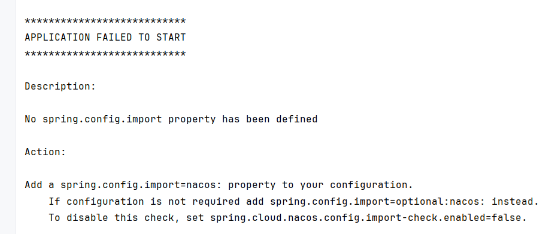
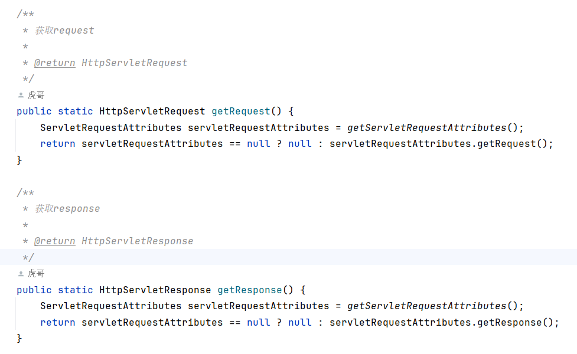
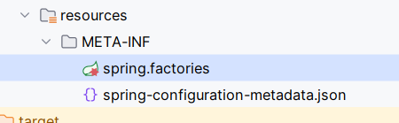
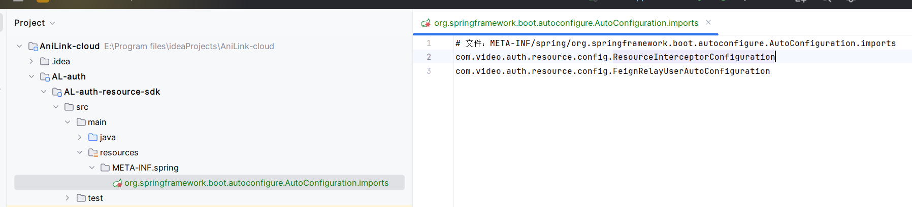
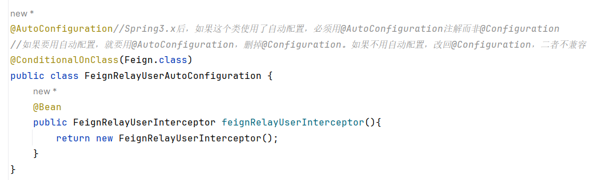
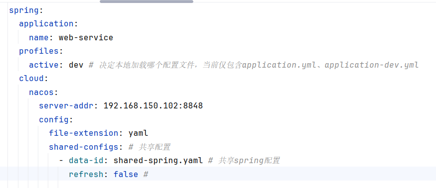

# 问题日志

## [2026-03-10-1] nacos 2.X 版本在spring cloud 2022.0.0.0-RC2读取配置文件失败

启动模块报错：



解决方案一（采纳）：[解决No spring.config.import property has been defined问题-CSDN博客](https://blog.csdn.net/zhiyikeji/article/details/119855619)

最后配置如下（在父工程和子模块都要引入）：

```xml
<properties>
	<!-- 我的spring版本为3.0.5 -->
    <spring-cloud-bootstrap.version>3.0.5</spring-cloud-bootstrap.version>
</properties>

<!-- （父模块）让bootstrap生效 -->
<dependency>
    <groupId>org.springframework.cloud</groupId>
    <artifactId>spring-cloud-starter-bootstrap</artifactId>
    <version>${spring-cloud-bootstrap.version}</version>
</dependency>

<!-- 子模块bootstrap生效 -->
<dependency>
    <groupId>org.springframework.cloud</groupId>
    <artifactId>spring-cloud-starter-bootstrap</artifactId>
</dependency>
```

解决方案二：[解决SpringCloud2022中Nacos因spring.config.import报错致配置读取失败-开发者社区-阿里云](https://developer.aliyun.com/article/1392085)

## [2026-03-12-2] Spring Gateway 根据服务名路由失败，报错 Service Unavailable, status=503

[Spring Gateway 根据服务名路由失败，报错 Service Unavailable, status=503 - 知乎](https://zhuanlan.zhihu.com/p/578210673)

## [2026-03-14-3] spring boot 3.0.5 Cannot access jakarta.servlet.http.HttpServletRequest

[Spring Boot3.0升级，踩坑之旅，附解决方案_spring boot3 shiro-CSDN博客](https://blog.csdn.net/m0_57042151/article/details/128215864)

[无法访问jakarta.servlet.http.HttpServletRequest_无法访问jakarta.servlet.servletrequest-CSDN博客](https://blog.csdn.net/qq_38254635/article/details/140996796)

相关代码：com/video/common/utils/WebUtils.java



在common模块的pom文件里，用

```xml
<!-- 主要利用它与网络连接相关的一些类 -->
<dependency>
    <groupId>jakarta.servlet</groupId>
    <artifactId>jakarta.servlet-api</artifactId>
    <version>6.0.0</version>
    <scope>provided</scope>
</dependency>
```

而非天机学堂的：

```xml
<dependency>
    <groupId>org.apache.tomcat.embed</groupId>
    <artifactId>tomcat-embed-core</artifactId>
    <version>9.0.38</version>
    <scope>provided</scope>
</dependency>
```


## [2026-03-14-4] 网关层里的过滤器和拦截器不会同时生效

在 Spring Cloud Gateway 微服务架构中：
- **`GlobalFilter`** ✅ **会生效**（网关层）
- **`HandlerInterceptor`** ❌ **不会生效**（WebMVC 层）

### **为什么拦截器不生效？**

Spring Cloud Gateway 基于 **WebFlux**（响应式编程），而 `HandlerInterceptor` 是 **WebMVC**（传统 Servlet）的组件，两者不兼容。

```
Spring Cloud Gateway (WebFlux)
    ├── 使用 Netty 服务器（非 Servlet 容器）
    ├── 不支持 HttpServletRequest/Response
    └── 不支持 HandlerInterceptor 拦截器
```

| 特性                 | GlobalFilter (网关过滤器) | HandlerInterceptor (拦截器) |
| -------------------- | ------------------------- | --------------------------- |
| **框架**             | Spring Cloud Gateway      | Spring WebMVC               |
| **底层**             | WebFlux (响应式)          | Servlet (传统)              |
| **生效范围**         | 网关路由级别              | Controller 级别             |
| **执行时机**         | 路由转发前后              | Controller 方法前后         |
| **适用场景**         | 网关层：鉴权、日志、限流  | 业务层：权限、日志          |
| **在网关中是否生效** | ✅ 是                      | ❌ 否                        |

### **启动日志验证**

当你启动网关服务时，会看到类似这样的日志：
```
2026-03-14 10:30:45.123  INFO 12345 --- [           main] o.s.b.web.embedded.netty.NettyWebServer  : Netty started on port 8080
2026-03-14 10:30:45.456  INFO 12345 --- [           main] .v.g.filter.AuthGlobalFilter             : 【GlobalFilter】初始化完成
```

注意看：使用的是 **Netty** 服务器，而不是 Tomcat，这说明确实是 WebFlux 环境。

### **如果需要在网关使用拦截器功能**

由于网关不支持 `HandlerInterceptor`，你可以：

#### **方式1：在 GlobalFilter 中实现**
```java
@Component
public class LoggingGlobalFilter implements GlobalFilter, Ordered {
    
    @Override
    public Mono<Void> filter(ServerWebExchange exchange, GatewayFilterChain chain) {
        // 前置处理（类似 preHandle）
        long startTime = System.currentTimeMillis();
        log.info("请求开始: {} {}", 
                 exchange.getRequest().getMethod(),
                 exchange.getRequest().getPath());
        
        return chain.filter(exchange)
            .doFinally(signalType -> {
                // 后置处理（类似 afterCompletion）
                long duration = System.currentTimeMillis() - startTime;
                log.info("请求完成: 耗时 {}ms", duration);
            });
    }
    
    @Override
    public int getOrder() {
        return Ordered.HIGHEST_PRECEDENCE;
    }
}
```

#### **方式2：使用 GatewayFilter 组合**
```java
@Component
public class CompositeFilter implements GlobalFilter, Ordered {
    
    private final List<GatewayFilter> filters = Arrays.asList(
        new LoggingFilter(),
        new AuthFilter(),
        new RateLimitFilter()
    );
    
    @Override
    public Mono<Void> filter(ServerWebExchange exchange, GatewayFilterChain chain) {
        GatewayFilterChain newChain = chain;
        
        // 链式执行所有过滤器
        for (GatewayFilter filter : filters) {
            newChain = new DefaultGatewayFilterChain(newChain, filter);
        }
        
        return newChain.filter(exchange);
    }
}
```

#### 方式3：像天机学堂一样在网关层后面再加一层拦截器专属微服务

具体做法暂时看不懂。

## [2026-03-17] SDK里的公共拦截器不生效

为了实现跨模块通信，需要封装一个公共拦截器，拦截请求进行信息存取，但是拦截器不能放在网关层，所以只能把拦截器封装在公共通信微服务里，需要用到拦截器的业务微服务引入其依赖即可。

### 1 自动配置从spring2.x到3.x的变迁

[SpringBoot3.0自动配置新方案：从spring.factories到AutoConfiguration.imports的平滑迁移指南-CSDN博客](https://blog.csdn.net/weixin_28339967/article/details/158863108)

一开始沿用天机学堂的自动配置写法，这个写法到spring3.x不是说不可以，而是不好。



spring3.x官方推荐写法：



### 2 要用@AutoConfiguration而非@Configuration

如文章内所述，自动配置和@AutoConfiguration是捆绑的，和@Configuration不兼容，如果用了自动配置，@Configuration就得换成@AutoConfiguration



因为这里卡了3个小时，Deepseek看了半天也没看出这个问题。

# 实践文档

## [2026-03-11] 使用环境变量配置KEY

[SpringBoot中yml配置文件使用系统环境变量_springboot yml ${}-CSDN博客](https://blog.csdn.net/mindset_/article/details/146226134)

必须把环境变量写在IDEA里的配置，不能单纯写在系统设置里。

## [2026-03-13] 使用Nacos共享配置

[springboot整合Nacos之共享配置和扩展配置-实践篇 - 知乎](https://zhuanlan.zhihu.com/p/607581233)

注意`profiles.active: dev`影响的是本地配置加载，不影响nacos命名空间。

